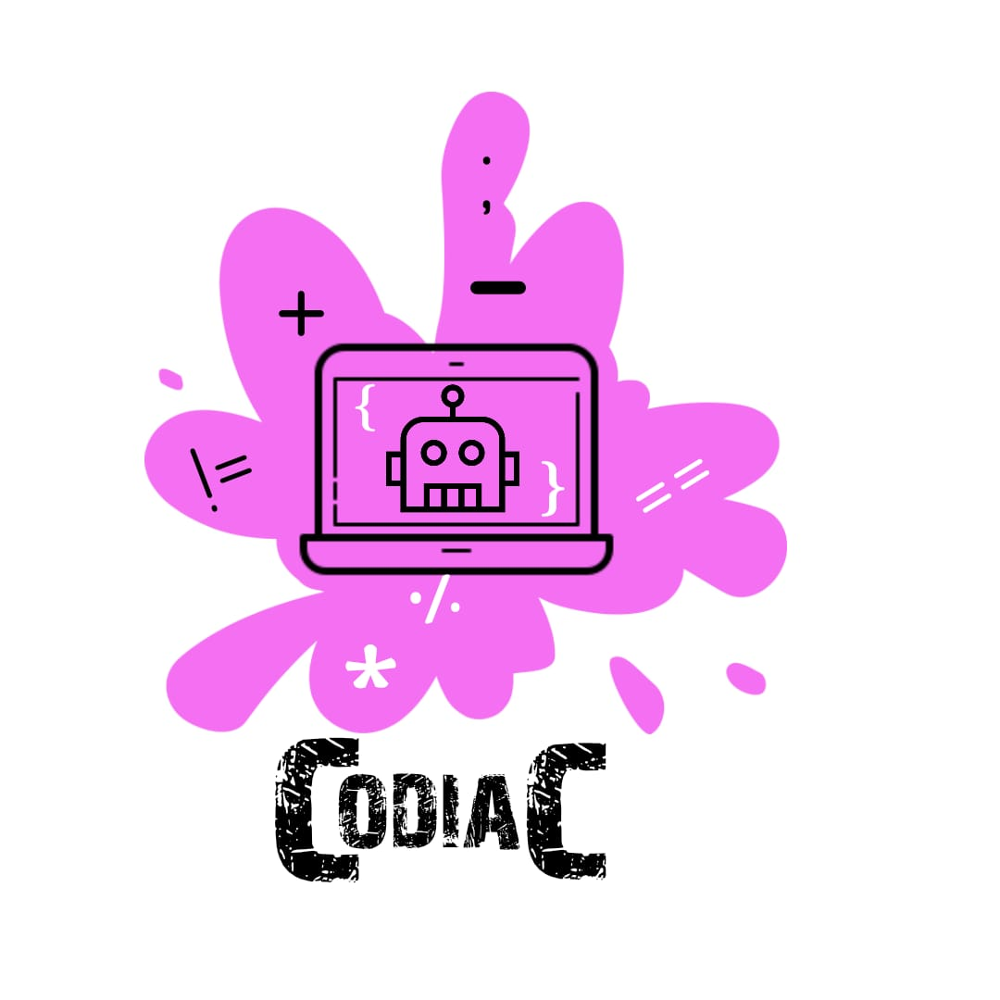

# Codiac



## Target Audience - Beginners in Coding

Codiac is a comprehensive collection of basics of coding.

With thousands of resources out there, it is pretty confusing to choose the right one. 

Codiac offers you exactly what you need as a beginner in coding.


## Persona

#### Person 1
> Someone just saw an article on coding and now wants to get started with coding right away.
> But with videos and tutorials all over the place in the internet, ze is not very sure how to get started with.
> What does ze do?
> Ze simply visits our website and our intelligent bot guides zir.

#### Person 2

> Someone has just started to code but ze finds a big word somewhere. 
> Ze has no idea how to implement it or use it to write his own code.
> Ze visits our website and  tells our bot that ze wants to know about that particular topic. 
> Our bot quickly teaches ze the basics of the topic. 

## Programming Languages taught

# C
<hr>

<hr>
<br>

# Python

<hr>

<hr>
<br>


## Topics we aim to cover
```
1. Algorithm  
2. About the Language (Who made it, what are the key features, why it is used)  
3. Getting started (Absolute beginner level guide to get started)  
4. Variables (What are variables? How to use them?)
5. Constants
6. Keywords 
7. Datatypes 
8. Operators
9. Control Structures
10. Arrays
11. Functions
12. Language specific basics 
```

## What else ?

We offer you interactive learning through our bot, Codiac.

Codiac is specialized to teach you all the basic concepts and answer your queries.

You are free to learn at your own pace with a personalized tutor handy at all time!

Codiac also allows you to share your queries and receive support through our discussion forum.

  


